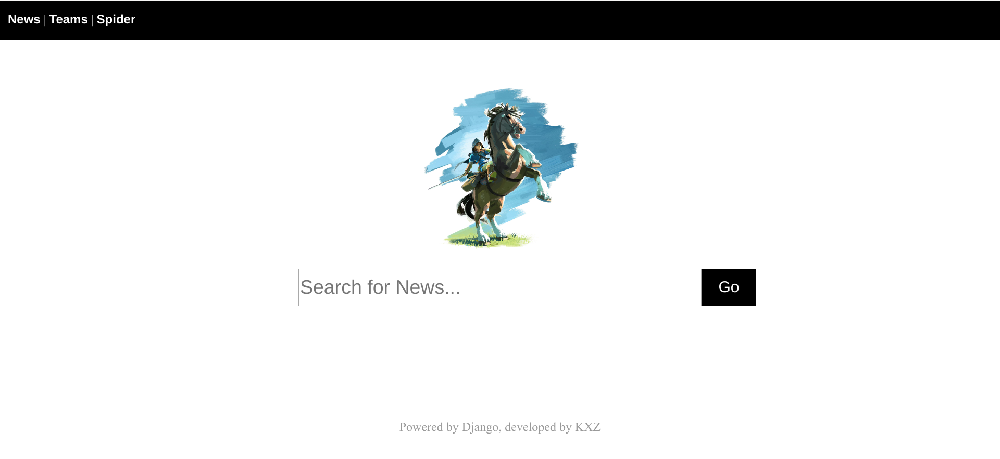
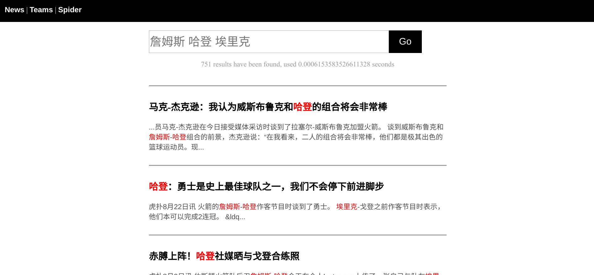
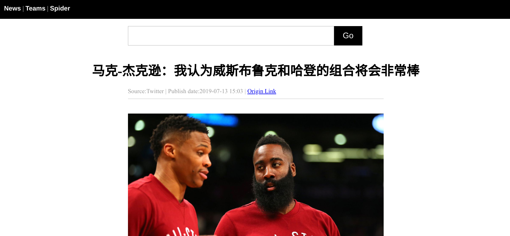
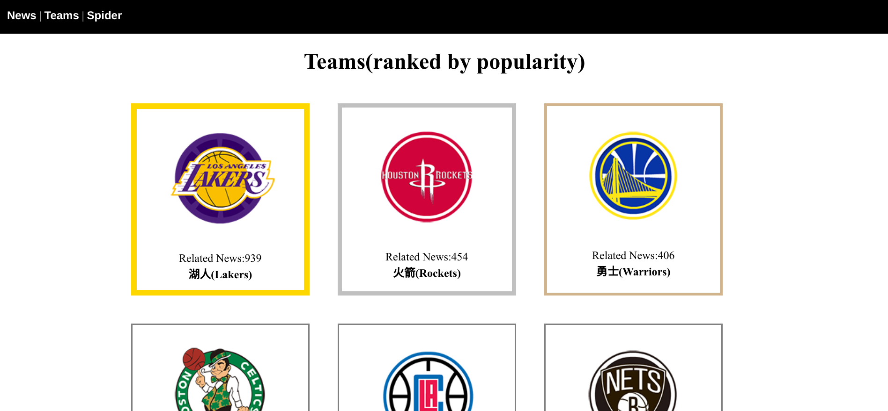
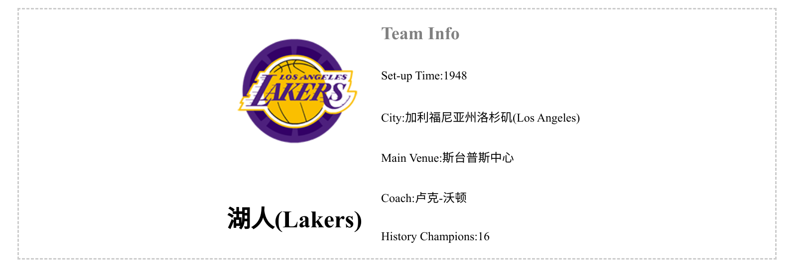
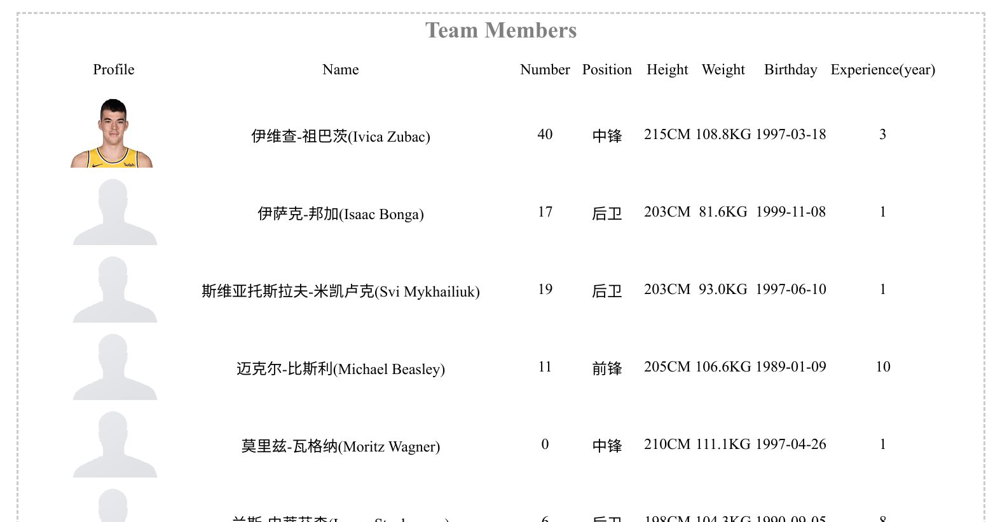
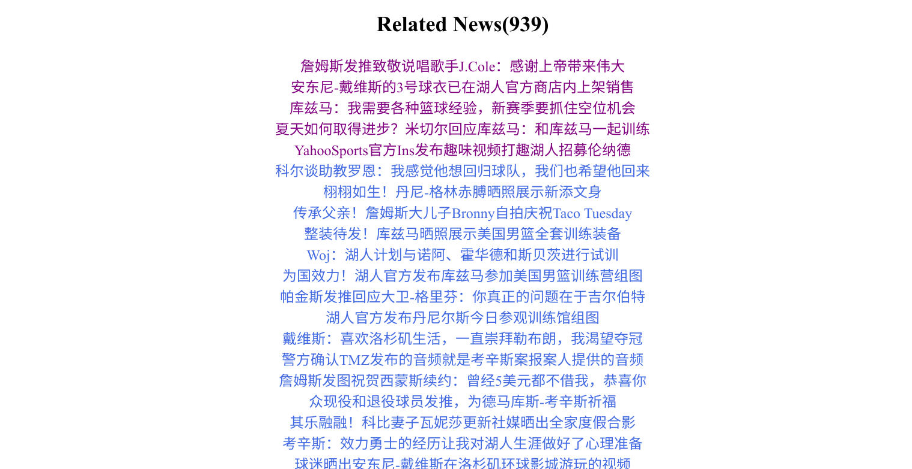
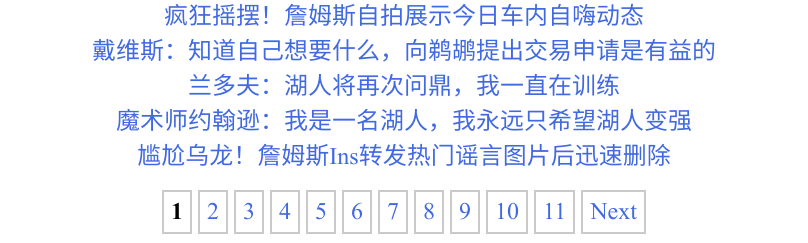
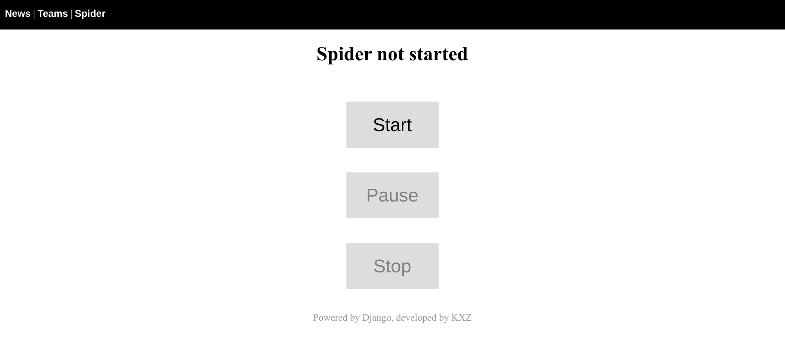

# 				  NBA新闻整合与检索系统

​																												计86 孔祥哲 2018011997

### 功能

---

#### 主界面

* 黑框条为导航栏，News 导引到当前主页，Teams 导航到NBA 球队按热度排行的页面，Spider 导航到动态爬虫页面
* 中间部分为搜索框，用于搜索新闻

#### 新闻搜索

* 新闻搜索页给出最相关新闻的简讯
* 支持多关键词搜索
* 为了便于交互，新闻一页只显示30条，设置页码进行跳转
* 点击标题可以进入相关新闻界面
* 新闻界面中的 Origin Link链接到新闻来源页

#### 队伍排行榜

* 按照相关新闻的数量对30支NBA 球队进行排行并且按顺序显示。前三名分别用金、银、铜的颜色强调边框
* 点击队伍名称或图标可以进入相应的球队主页

#### 球队主页

球队主页主要由基本信息、球队成员、相关新闻三部分组成

##### 基本信息

* 第一部分为基本信息，包含球队名称、logo、成立时间、所在城市、主场馆、教练、历史冠军数等信息

##### 球队成员

* 第二部分为队伍成员，展示队员照片、名字、号码、位置、高度、重量、生日、球龄等信息

##### 相关新闻

* 相关新闻给出所有与该球队相关的新闻的标题
* 点击新闻标题可以跳转到相应的新闻页  

* 并且为了便于交互，相关新闻同样设置了页码

#### 动态爬虫

* 动态爬虫页面最顶上为显示爬虫状态的语句，可能出现未开始、运行中、已暂停三种状态
* 点击Start 按钮可以使爬虫进行工作，开始工作后可以点击 Pause 暂停（暂停状态下此按钮显示为 Continue，再按可恢复运行），点击 Stop 使爬虫停止工作
* 爬虫爬取的新新闻会动态加载到新闻库，因此 News 页面和 Teams 页面会进行动态更新

---

### 性能统计

---

#### 总新闻量

初始状态总新闻量为6000，可通过动态爬虫扩增（来源为虎扑）

#### 查询时间

查询詹姆斯，搜到668条新闻，用时约在 10^(-4) s 的数量级，根据匹配到的新闻数量，用时会有所浮动，匹配项越少，查询速度越快

---

### 涉及的技术

---

* 在服务器开启时先对所有新闻进行预处理，通过`python`的`jieba`库的`cut`函数进行分词并建立倒排索引
* 在接受搜索内容之后，对搜索内容使用`jieba.analyse.extract_tags`函数进行分词，从倒排索引中找出匹配项，并且通过不同关键词有不同的词频（重要程度）（利用TF-IDF算法）给匹配项赋值。标题中每出现一个关键词，给该条新闻的值加上关键词权重的10倍，正文中每出现一个关键词，给该条新闻的值加上关键词权重的1倍。最后将值高的新闻项排在前面输出。

---

